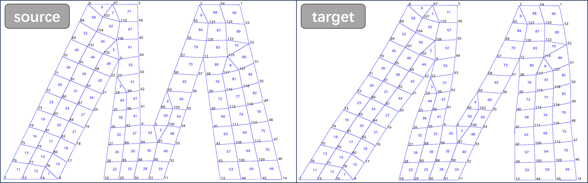
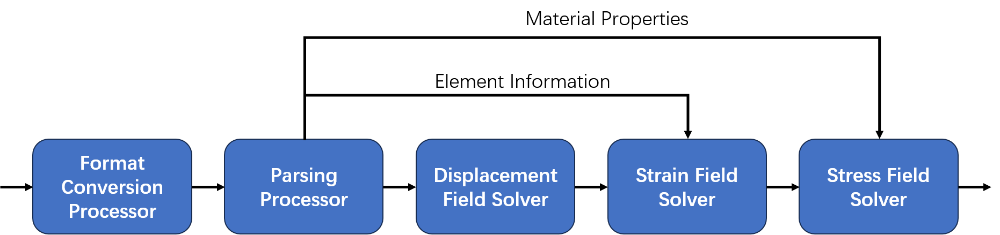

# mesh2stress
[](https://opensource.org/licenses/MIT)


>  根据变形前后的网格计算应力分布。

---

## 版本
- v0.1.0
> 项目目前正在进行中。将在接下来的几个月里完成代码的编写。

## 语言
- [English]

## 许可协议
- MIT

## 说明
该程序基于变形前后的源网格和目标网格提取位移场，计算应力分布。代码是用<b>python</b>编写的，主要是为了易于阅读和快速开发，因此没有发挥出完全的计算效率。计划后续版本（V2）使用C++语言对核心代码进行优化。



程序模块如下图所示：



- <b>格式转化处理器：</b>提供输入接口，用于处理输入信息，将其转化为程序所接受的格式。[当前版本](#版本)程序输入为源网格和目标网格的`.inp`文件，其中源网格需要包含网格的类型和节点坐标信息、材料信息。
- <b>预处理器:</b>解析网格数据，提取并重构节点、单元、材料等对象；
- <b>位移场求解器:</b>对比源网格和目标网格的节点坐标，求解位移场；
- <b>应变场求解器:</b>结合单元类型，对位移场进行计算，求解应变场；
- <b>应力场求解器:</b>结合材料属性，对应变场进行计算，求解应力场；
- <b>输出:</b>以`np.ndarray(N, 2)`格式输出节点上应力张量, 其中N为节点数量，第1列为节点编号，第2列为元组形式表示的无量纲张量值(节点平均)。

## 快速使用

在python环境中运行`main.py`：

```
python main.py source.inp target.inp \
    --averageMethod='Advanced' \
    --averageVariation=75 \
    --useCornerData=True \
    --outputFile=True \
    --tolerance=False \
    --unit='N-mm'
```
其中可选参数：
- averageMethod:结果平均方法(默认为`Advanced`)；
- averageVariation:差异值(百分比，默认为`75`)
- useCornerData:纳入角节点(默认为`True`)
- outputFile: 指定输出`.txt`文件(默认为`True`，将保存在`source.inp`所在目录，名称为`result.txt`)；
- tolerance: 位移容差，位移超出容差的节点不进行应力计算(默认为`False`，目的是避免配准错误造成的计算结果异常，计划在后续V2版本进行开发)；
- unit:单位制(默认为`'N-mm'`)
- registration: 配准方法，用于平滑或补偿(默认为`None`，当前版本此参数无影响，计划在后续V2版本进行开发)；

## 未来工作
- v0.1 : 开发版本
    - 处理器、求解器等代码开发，实现基础功能；
    - 单元类型：T3D2, S3, S4, S4R, C3D4, C3D8；
    - 材料类型：线弹性材料；
    - 截面属性：桁架、壳、实体；
    - 文档编写和测试工作；
- v1.0 : 发布版本
    - 更丰富的材料属性支持；
    - 更丰富的单元类型支持；
    - GUI和可视化；
- v2.0 : 迭代版本
    - 高性能：核心求解器使用编译语言(如C++)重构，提升计算效率，目标实现实时计算；
    - 控制参数：面向应用场景，提供控制参数（如残差控制、容差控制等）；
    - 更多输入：丰富格式转换接口，支持更多类型的输入；
    - 更多输出：如计算应变能密度分布等；

[English]: ../README.md