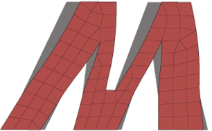

# mesh2stress

>  根据变形前后的网格计算应力分布。

## 版本
- V0.1.0

## 语言
- [English]

## 许可协议
- MIT

## 说明
该程序基于变形前后的源网格和目标网格提取位移场，计算应力分布。代码是用<b>python</b>编写的，主要是为了易于阅读和快速开发，因此没有发挥出完全的计算效率。计划后续版本（V2）使用C++语言对核心代码进行优化。

[English]: ../README.md